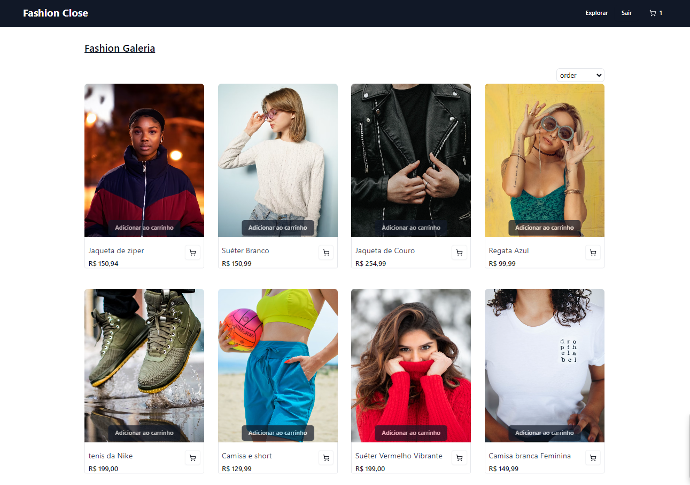

# Ecoomerce Fashion Close

## Descrição

Este projeto é uma aplicação web desenvolvida em React com TypeScript. O objetivo é simular um fluxo de compra, utilizando Redux para gerenciar o estado da aplicação, sem a necessidade de um backend.

## Acesse o Projeto

Você pode acessar a aplicação hospedada no Vercel através do seguinte link:
[Fashion Close -> ](https://doug-fashion.vercel.app/)



## Tecnologias Utilizadas

- **Frontend**: React, TypeScript, Redux, Redux Toolkit, React Router, React hook form, Zod
- **Estilização**: Tailwind CSS, ui Shadacn, Lucide React
- **Persistência de Dados**: Redux para armazenar e repassar dados entre as páginas

## Como Executar o Projeto

1. Clone o repositório, usar o seguinte comando no seu terminal:

```bash
git clone https://github.com/DouglasB834/doug-fashion.git
```

2. Navegue até o diretório do projeto.

```bash
 cd doug-fashion
```

3. Execute comando para instalar as dependências.

```bash
 yarn install
```

4. Inicie o servidor de desenvolvimento:

```bash
   yarn dev
```

### 5. Acesse a aplicação em `http://localhost:5173`.

## Requisitos do Projeto

Desenvolvimento front-end utilizando React e TypeScript. Criar uma aplicação simples que simula um fluxo de compra, sem a necessidade de backend, utilizando Redux para gerenciar o estado da aplicação.

Requisitos do Projeto

## 1. Login:

○ Crie uma página de login onde o usuário deverá inserir um nome e um email para prosseguir.

○ Valide que ambos os campos estão preenchidos antes de permitir o login.

○ Armazene os dados do usuário utilizando Redux.

## 2. Produtos:

- ○ Crie uma página que exiba uma lista de produtos fictícios. Cada produto deve conter pelo menos um nome, uma descrição e um preço.

- ○ Permita que o usuário selecione a quantidade de cada produto que deseja comprar.

- ○ Os produtos selecionados e suas respectivas quantidades devem ser armazenados no Redux.

## 3. Finalizar Compra:

- ○ Crie uma página de resumo onde o usuário pode ver os produtos selecionados, suas quantidades e - o valor total da compra.

- ○ Inclua um botão para finalizar a compra.

- ○ Ao clicar em "Finalizar Compra", exiba um modal de confirmação informando que a compra foi concluída com sucesso.

- ○ Limpe os dados armazenados no Redux após a conclusão da compra.

## Tecnologias Utilizadas

● Tecnologias: React, TypeScript, Redux. redux toolkit

● Interface: Utilize CSS ou frameworks como Material-UI para estilizar as páginas de forma simples e funcional.

● Persistência de Dados: Utilize Redux para armazenar e repassar os dados entre as páginas.

● Não foi é necessário: pasta services e para simular uma conexão com uma rota fictícia.

Critérios

● Organização e clareza do código.

● Uso adequado do Redux para gerenciar o estado da aplicação.

● Implementação correta das funcionalidades solicitadas.

● Simplicidade e funcionalidade da interface de usuário.

● Atenção aos detalhes, como validações e exibição de mensagens ao usuário.
